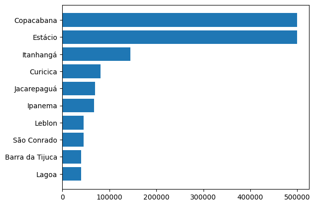

# 🏠 Análise de Preços de Imóveis no Airbnb – Rio de Janeiro

Este projeto analisa dados públicos do Airbnb no Rio de Janeiro com foco em entender os principais fatores que impactam o preço de aluguel por temporada.

## 📌 Objetivo
Investigar os seguintes pontos:
- Quais bairros têm o maior e menor preço por noite?
    - Top 10 maiores valores: 
    - Top 10 menores valores: 
- Qual o impacto da avaliação e número de acomodações no preço?
    - Relação entre preços e avaliações: 
- Quais os tipos de imóveis mais comuns?
    casa/apartamento inteiro: 